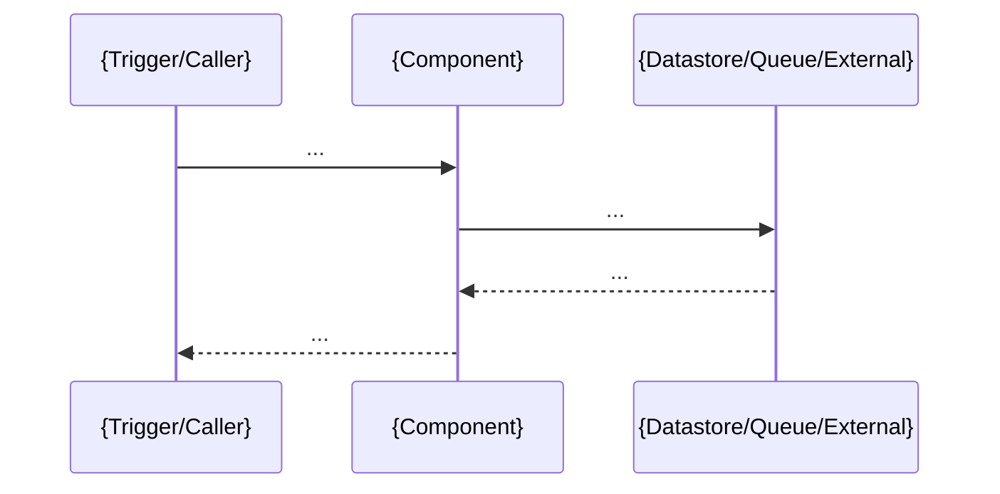
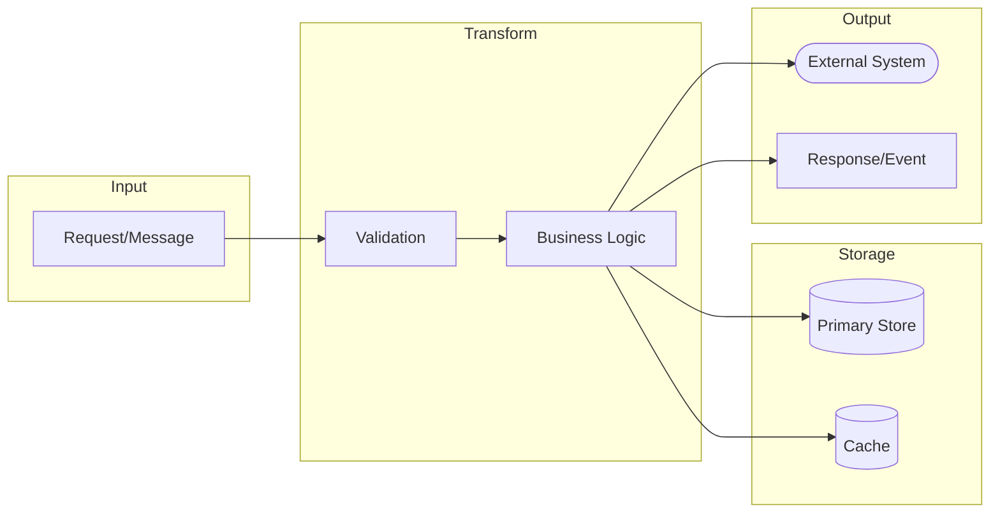

**Mandatory preparation:** read [codebase overview](../instructions/include/codebase-overview.md) instructions in full and follow strictly its rules before executing any step below.

## Goal

Create (or update): [runtime flows](../../docs/codebase-overview/runtime-flow-*.md)

Also ensure they are linked from: [codebase overview](../../docs/codebase-overview/README.md) output

---

## Discovery (run before writing)

### A. Refresh what is already known

1. Review:
   - [repository map](../../docs/codebase-overview/repository-map.md)
   - All component documents: `docs/codebase-overview/component-*.md`
2. Extract into working notes:
   - All entry points (HTTP, CLI, schedulers, message consumers)
   - Known external integrations
   - Known datastores and queues/topics
   - Any existing "critical paths" mentioned (even if non-authoritative)

### B. Locate orchestration and routing points (code-driven)

Search for and open the files that define or register:

1. HTTP routing / controllers / endpoints (router registration points)
2. Message consumers / subscription registration (topics/queues, consumer groups)
3. Job schedulers / cron definitions (where schedule → handler is wired)
4. Pipeline definitions / workflow coordinators (if present)
5. Cross-cutting middleware that affects flows (auth, validation, transactions, retries)

### C. Identify workflow semantics (if any)

1. Identify domain events, event names, and where they are:
   - Emitted/published
   - Consumed/handled
2. Identify workflow engines / orchestration frameworks if present.
3. Collect candidate flows from these artefacts.

---

## Steps

### 1) Select critical flows (explicit criteria)

1. Select **16** flows that best represent how the system behaves in production.
2. Prefer flows that are:
   - Frequently used (core user journeys)
   - Business-critical (creates/updates key entities, payments, fulfilment, etc.)
   - Operationally important (background processing, ingestion, reconciliation)
   - Risk-heavy (auth, permissions, data integrity, external dependencies)
3. Ensure coverage across:
   - At least one **interactive** flow (HTTP/UI/API request)
   - At least one **asynchronous** flow (event/queue)
   - At least one **scheduled** flow (cron/job) if schedulers exist
4. Each selected flow must either:
   - Map to real code/config with evidence, or
   - Be recorded as **Unknown from code – {action to locate/confirm}**

### 2) Create one document per flow (consistent naming and scope)

For each flow, create:

- `docs/codebase-overview/runtime-flow-[XXX]-[name].md`

Where:

- `[XXX]` is a stable numeric order (e.g. `001`, `002`, `003`, ...) so links don't churn
- `[name]` is short and meaningful (kebab-case)
- Use the same component names as in `component-*.md` (consistency rule)

Each flow document must capture:

#### 2A. Flow identity and trigger

- Flow name
- Trigger type:
  - HTTP request / message consumed / schedule / CLI / internal timer
- Trigger location:
  - Route + handler, consumer registration, schedule definition, or command entry point

#### 2B. Narrative (focused and concrete)

Write a short narrative that includes:

- Preconditions (auth, required inputs) if evidenced
- Main steps (7–15 bullets, each a single action)
- Outcome (what is created/updated/emitted)
- Key side effects (events published, notifications sent, files written)

#### 2C. Sequence diagram (Mermaid, component-level)

- Use a Mermaid sequence diagram showing collaborating components and external services.
- Keep participants at the **component** level (not individual functions), unless the repo is very small.
- Show:
  - The trigger
  - Main calls/messages
  - Datastore interactions
  - Published events / queued work

#### 2D. Data flow and lineage (only if evidenced)

Capture a brief, evidence-based view of how data moves through the flow.

##### Data flow diagram (Mermaid flowchart)

- Use a Mermaid `flowchart LR` (left-to-right) diagram showing data movement.
- Show:
  - Input data sources (files, requests, messages)
  - Processing/transformation steps
  - Data stores (reads and writes)
  - Output destinations (responses, events, files)
- Use subgraphs to group related elements (e.g., `subgraph Input`, `subgraph Transform`, `subgraph Output`).
- Use different node shapes:
  - `[text]` for processes/transforms
  - `[(text)]` for databases/stores
  - `([text])` for external systems
  - `>text]` for files/documents

##### Data lineage summary

- **Key data elements:** {entities/messages/files involved}
- **Read points:** {what is read, from where, and by which component}
- **Write points:** {what is written, to where, and by which component}
- **Transformations:** {validation/enrichment/mapping steps and where they happen}
- **Lineage notes:** {origin → transformations → destinations} (1–3 bullets)

If any item cannot be supported by code/config, record:

- **Unknown from code – {action}**

#### 2E. Reliability and failure behaviour (only if evidenced)

- Validation and error mapping (where errors become responses/messages)
- Retries and backoff (where configured)
- Idempotency (keys, dedupe tables, exactly-once semantics if present)
- Timeouts / circuit breakers (if present)
- Compensation / rollback (transactions, sagas, compensating actions) if present

#### 2F. Evidence (mandatory)

- Evidence bullets with:
  - File paths (URLs must be prefixed with `/` so links resolve correctly)
  - Symbols and/or config keys (routes, handlers, consumer names, schedule strings, env vars)
- If anything is unclear or not supported, record:
  - **Unknown from code – {action to confirm}**

### 3) Keep unknowns visible (no guessing)

1. If a step is implied but not evidenced (e.g. "sends email"), record:
   - **Unknown from code – locate integration client / call site**
2. If a diagram participant is assumed but not found, record:
   - **Unknown from code – verify component exists / find wiring**

### 4) Write concisely, then iterate

1. Draft all flow documents first.
2. Then do a second pass:
   - Tighten narratives and remove speculation
   - Improve evidence links
   - Replace vague statements with concrete route/topic/schedule names
   - Ensure diagrams reflect the narrative and evidence

### 5) Update the index

Update: [codebase overview](../../docs/codebase-overview/README.md) with a **Runtime Flows** section linking to every flow document (in `[XXX]` order).

Also add (or update) a brief flow index table in the README (evidence-based):

- Flow | Trigger | Primary components | Primary datastore | Async? | Evidence link

Where relevant, include cross-cutting notes in the README (link once, then reference):

- Authentication/authorisation path (middleware/filters)
- Transaction boundaries (where commits happen)
- Correlation IDs / trace propagation

---

## Template snippet per flow

````markdown
# Runtime Flow {name}

## Trigger

- Type: {HTTP | Message | Scheduled | CLI | Internal}
- Location: {route/topic/schedule/command} – evidence link

## Narrative

- ...
- ...
- ...

## Sequence



## Data flow and lineage (only if evidenced)



- Key data elements: ...
- Read points: ...
- Write points: ...
- Transformations: ...
- Lineage notes: ...

## Reliability and failure behaviour

- Error handling: ...
- Retries/backoff: ...
- Idempotency: ...
- Timeouts: ...
- Unknowns: ...

## Operational notes (only if evidenced)

- Expected concurrency (workers, consumers): ...
- Backpressure mechanism (queue depth, rate limits): ...

## Evidence

- Evidence: [/path/to/file](/path/to/file#L75-L140) - {handler/function/route/topic/schedule/config key}
- Evidence: Unknown from code – {action}
````

---

> **Version**: 1.2.8
> **Last Amended**: 2026-01-05
