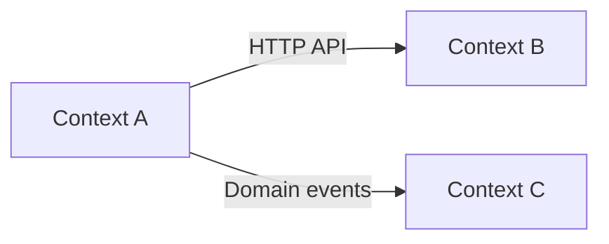

**Mandatory preparation:** read [codebase overview](../instructions/include/codebase-overview.md) instructions in full and follow strictly its rules before executing any step below.

## Goal

Create (or update) these domain analysis documents (evidence-first):

- [bounded contexts](../../docs/codebase-overview/domain-01-bounded-contexts.md)
- [ubiquitous language](../../docs/codebase-overview/domain-02-ubiquitous-language.md)
- [context map](../../docs/codebase-overview/domain-03-context-map.md)
- [domain events catalogue](../../docs/codebase-overview/domain-04-domain-events.md)
- [boundary and modelling notes](../../docs/codebase-overview/domain-05-boundary-notes.md)

Also ensure they are linked from: [codebase overview](../../docs/codebase-overview/README.md) output

---

## Discovery (run before writing)

### A. Refresh architectural context

1. Review:
   - [repository map](../../docs/codebase-overview/repository-map.md)
   - All component documents: `docs/codebase-overview/component-*.md`
   - All runtime flow documents: `docs/codebase-overview/runtime-flow-*.md`
2. Extract into working notes:
   - Deployable units and component names (use the same names)
   - Datastores and ownership statements (if any)
   - Integration surfaces (HTTP routes, topics/queues, schedules)
   - Any existing domain terms (from code identifiers, schemas, endpoint names)

### B. Locate domain model signals (code-driven)

Search for and open code/config that commonly reveals domain boundaries and language:

1. Domain packages/modules (e.g. `domain/`, `model/`, `entities/`, `aggregates/`, `commands/`, `handlers/`)
2. Schema sources (migrations, ORM models, JSON schema, OpenAPI, protobuf/avro, event schemas)
3. Event definitions and usage (publish/consume sites, event name constants/enums)
4. Validation/invariant logic (domain services, validators, guard clauses)
5. Cross-boundary calls (clients to other services/packages, direct DB access across areas)

### C. Capture candidate domain terms

1. Create a short list of candidate terms from:
   - Entity/table/collection names
   - DTOs/API request/response types
   - Event names and payload fields
   - Route paths and command names
2. Prefer terms that appear in multiple places.

---

## Steps

### 1) Identify bounded contexts (evidence-based)

1. Propose candidate bounded contexts by clustering:
   - Components/services/packages
   - Owned data (tables/collections)
   - Event streams and integration surfaces
   - Shared domain terms
2. For each bounded context, define (only if evidenced):
   - **Name** (use terms seen in code)
   - **Purpose** (what business capability it represents)
   - **Owned data** (source-of-truth entities/tables/collections)
   - **Key invariants** (business rules enforced) and where they live
   - **Primary interfaces** (APIs/events/commands) it exposes
   - **Upstream/downstream relationships** (who depends on whom)
3. If boundaries are unclear, record:
   - **Unknown from code – {action to confirm boundary}**

Write/update: `docs/codebase-overview/domain-01-bounded-contexts.md`

Include a brief index table:

- Context | Purpose | Owned data | Key interfaces | Evidence link

---

### 2) Document ubiquitous language (terms and meanings)

Create/update: `docs/codebase-overview/domain-02-ubiquitous-language.md`

1. Capture 30–60 terms (aim for quality over quantity).
2. For each term, record:
   - **Definition** (plain language; 1–2 sentences)
   - **Synonyms/aliases** (if multiple names exist)
   - **Where used** (paths/symbols; schemas; routes; events)
   - **Context** (which bounded context(s) use it)
   - **Notes on ambiguity** (if the term means different things)
3. If the meaning cannot be inferred from code/schema, record:
   - **Unknown from code – {action to confirm meaning}**

Include an "Ambiguities and conflicts" section (terms used inconsistently) with evidence.

---

### 3) Create a context map (relationships and integration styles)

Create/update: `docs/codebase-overview/domain-03-context-map.md`

1. For each pair of bounded contexts with a relationship, record:
   - Relationship direction (upstream/downstream)
   - Integration style (HTTP API, async events, shared DB, shared library, file/object storage)
   - Any translation layer (Anti-Corruption Layer, mapping code), if evidenced
2. Include a Mermaid diagram (flowchart) showing contexts and arrows.
3. Highlight risky couplings (only if evidenced), such as:
   - Direct database access across contexts
   - Shared mutable tables/schemas
   - Shared libraries that contain business rules for multiple contexts

If a relationship is suspected but not evidenced, record:

- **Unknown from code – {action to locate integration}**

---

### 4) Build a domain events catalogue (business meaning + evidence)

Create/update: `docs/codebase-overview/domain-04-domain-events.md`

1. Identify domain events (or event-like messages) from code/config:
   - Event name constants/enums
   - Producer publish sites
   - Consumer handler registrations
   - Schema locations
2. For each event, record:
   - **Event name**
   - **Business meaning** (what happened, past tense)
   - **Producer context/component**
   - **Consumers** (contexts/components)
   - **Schema/payload location**
   - **Delivery semantics** (at-least-once, retries) if evidenced
   - **Idempotency/deduping** approach if evidenced
3. If it is unclear whether an event is truly "domain" vs "technical", record:
   - **Unknown from code – confirm classification**

Include an index table:

- Event | Producer | Consumers | Schema | Evidence link

---

### 5) Capture modelling and boundary notes (practical DDD insights)

Create/update: `docs/codebase-overview/domain-05-boundary-notes.md`

1. Record evidence-based notes on:
   - Where business rules live (domain services vs application services vs controllers)
   - Aggregate boundaries (where transactional consistency appears to be enforced)
   - Shared kernel candidates (shared types that are genuinely stable)
   - Boundary violations (imports/DB access/event coupling that crosses contexts)
2. Keep this constructive and specific:
   - What is happening
   - Why it matters
   - Where it is in code (evidence)
   - What to verify next (Unknown from code actions where needed)

---

### 6) Update the index (README)

Update: [codebase overview](../../docs/codebase-overview/README.md) with a **Domain Analysis (DDD)** section linking to:

- `domain-01-bounded-contexts.md`
- `domain-02-ubiquitous-language.md`
- `domain-03-context-map.md`
- `domain-04-domain-events.md`
- `domain-05-boundary-notes.md`

Also add a short "Domain quick facts" subsection (evidence-based):

- Number of bounded contexts
- Primary integration styles (HTTP/events/shared library/etc.)
- Key datastores by context
- Top 7 domain terms (with links)

---

## Evidence and unknowns (mandatory)

- Every major statement must include an **Evidence** bullet with:
  - File path links (URLs must be prefixed with `/` so links resolve correctly)
  - Symbols/config keys/schema names/event names
- When evidence cannot be found, record:
  - **Unknown from code – {action}**

---

## Template snippets

### Evidence snippet

```md
### Evidence

- Evidence: [/path/to/file](/path/to/file#L10-L32) - {symbol or config key}
- Evidence: Unknown from code – {action}
```

### Mermaid context map (example)



---

> **Version**: 1.0.1
> **Last Amended**: 2026-01-05
