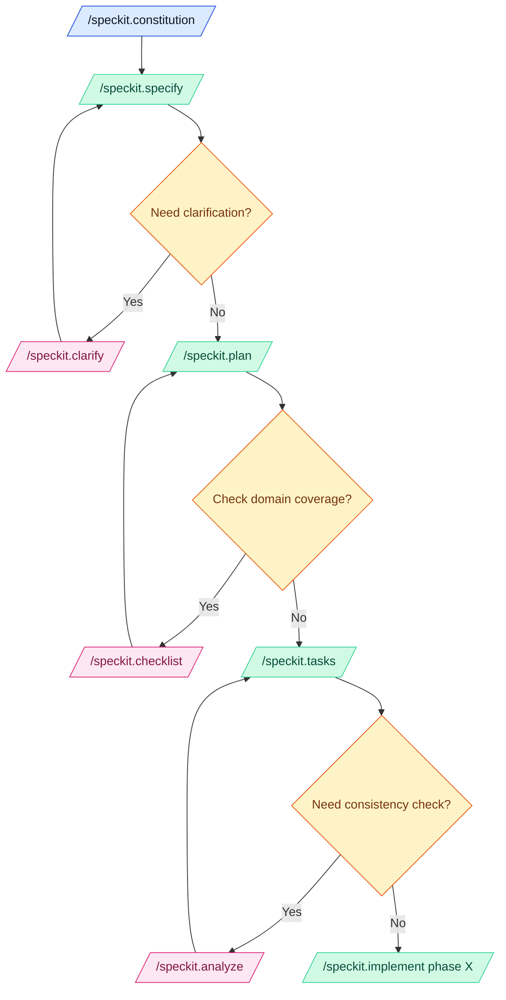

<div align="center">

# 🤖 AI-assisted Development Prompt Files

[](https://github.com/stefaniuk/promptfiles)
[](LICENCE.md)
[](CONTRIBUTING.md)

**A curated, specification-first library of prompts, instruction packs, skills, and Copilot agents**

_Keep AI helpers aligned with the spec-kit operating model • Copy-and-paste reuse • Deterministic workflows_

[Quick Start](#-quick-start) •
[Features](#-why-use-this-library) •
[Artefacts](#-featured-artefacts) •
[Workflow](#-operational-workflow) •
[Contributing](#-contributing)

</div>

---

## 🚀 Quick Start

Get up and running in minutes:

| Step  | Action                                                                                                              |
| :---: | ------------------------------------------------------------------------------------------------------------------- |
| **1** | ✂️ **Copy** the prompts or instruction packs you need straight into downstream repositories                         |
| **2** | 📦 **Install** instructions by copying guidance into `.github/instructions` so Copilot inherits rules automatically |
| **3** | 🤖 **Use** prompts under `.github/prompts` or agents under `.github/agents` to plan, spec, and review               |
| **4** | 🧪 **Validate** by running `make lint` and `make test` whenever you touch source material                           |
| **5** | 🧠 **Document** architectural reasoning in `docs/adr` for future context                                            |

---

## ✨ Why Use This Library

<table>
<tr>
<td width="50%">

### 📜 Specification-First Truth

Prompts, agents, and skills are written directly against the spec-kit constitution, so code, docs, and governance remain synchronised.

### 🛡️ Consistent Guardrails

Instruction packs apply deterministic lint, test, and review rules across every repo, ensuring Copilot never drifts from agreed standards.

</td>
<td width="50%">

### ⚙️ Deterministic Automation

Every workflow leans on `make lint`, `make test`, and explicit governance gates, keeping behaviour measurable and testable.

### 📦 Copy-Ready Building Blocks

Everything is shippable by folder, making large organisations faster to onboard.

</td>
</tr>
</table>

---

## 📦 Featured Artefacts

> **Tip:** Each pack is designed for copy-paste reuse. Pick what you need!

| Pack                                                        | Description                                                                                                                 |
| :---------------------------------------------------------- | :-------------------------------------------------------------------------------------------------------------------------- |
| 🤖 **[.github/agents](.github/agents)**                     | Ready-to-run Copilot agents (analyse, clarify, constitution, implement, plan, specify, tasks) tuned for spec-kit ceremonies |
| 💬 **[.github/prompts](.github/prompts)**                   | Focused prompt files for documentation reviews, governance gates, tests, and refactoring support                            |
| 📋 **[.github/instructions](.github/instructions)**         | Coding standards and best practice packs scoped by file glob so Copilot always sees the right rules                         |
| 🧠 **[.github/skills](.github/skills)**                     | Bundled instructions plus helper assets that extend Copilot's capabilities for niche workflows                              |
| 📝 **[.specify/templates](.specify/templates)**             | Seed specs, plans, and tasks for new features                                                                               |
| 📄 **[docs/adr/adr-template.md](docs/adr/adr-template.md)** | Opinionated ADR template aligned with spec-kit identifiers                                                                  |

---

## 🔄 Operational Workflow

The spec-kit lifecycle: **discover** the right prompt → **ground** it in a specification → **automate** every validation step.

### 📊 Workflow Diagram



### 📤 Sync Prompt Files

```bash
make apply dest=/absolute/path/to/target
```

<details>
<summary><strong>What gets copied?</strong></summary>

- `.github/agents`, `.github/instructions`, `.github/prompts`, `.github/skills`
- `.github/copilot-instructions.md`
- `.specify/memory/constitution.md`
- `docs/adr/adr-template.md`, `docs/.gitignore`

</details>

> **Next step:** Review git status in the target repo, commit, and run `make lint && make test`

### 📊 Estimate Context Window Usage

```bash
# Default: scan Copilot prompt files
make count-tokens

# Scan all markdown, sorted by size
make count-tokens args="--all --sort-by tokens"

# Target specific paths
make count-tokens args=".github/instructions .specify"
```

The report shows:

- **Tokens** — per-file token counts
- **No IDs** — counts with identifiers like `[ID-<prefix>-NNN]` stripped
- **Usage %** — context window usage (200K baseline)

### 🛡️ Governance Gates

Explicit checkpoints between specification and implementation:

| Gate                   | Command                         | Purpose                                       |
| :--------------------- | :------------------------------ | :-------------------------------------------- |
| 📄 **Documentation**   | `/review.speckit-documentation` | Consistency across spec.md, plan.md, tasks.md |
| ✅ **Code Compliance** | `/review.speckit-code`          | Reconcile implementation with spec            |
| 🧪 **Test Quality**    | `/review.speckit-test`          | Ensure healthy test pyramid                   |
| 🧰 **Instructions**    | `/enforce.[tech]`               | Lint & test at every delivery phase           |

<details>
<summary><strong>Why governance gates matter</strong></summary>

- **Deterministic flow** — each gate blocks the next phase until resolved
- **Auditability** — checklist evidence for compliance reviews
- **Scalability** — repeatable tasks across dozens of teams
- **Fewer regressions** — catch integration issues early
- **Better onboarding** — contributors understand the lifecycle from tasks.md

</details>

---

## 🧭 Prompt Naming Convention

Prompts use a **prefix + category + verb** convention to keep fuzzy search fast and predictable:

| Prefix      | Purpose                                     | Example                         |
| :---------- | :------------------------------------------ | :------------------------------ |
| `speckit.`  | Spec-kit lifecycle steps                    | `speckit.plan.prompt.md`        |
| `codebase.` | Evidence-first codebase documentation flows | `codebase.01-repository-map...` |
| `enforce.`  | Instruction compliance enforcement          | `enforce.python.prompt.md`      |
| `review.`   | Review and audit prompts                    | `review.speckit-code.prompt.md` |
| `util.`     | Operational utilities                       | `util.gh-pr-review.prompt.md`   |

## 🗺️ Roadmap

<details>
<summary><strong>📝 New Prompts</strong></summary>

- `architecture-review.prompt` — architect for flow
- `migrate-from-[tech A]-to-[tech B].prompt`

</details>

<details>
<summary><strong>📋 Instruction Packs</strong></summary>

- GitHub Actions workflow instructions
- Docker and Markdown conventions

</details>

<details>
<summary><strong>🔧 Workflow Prompts</strong></summary>

- **PR creation** — spec-linked descriptions with reviewer checklists
- **ADR prompt** — author/update decision records from specs
- **Release notes** — changelog entries grouped by spec identifiers

</details>

---

## 🤝 Contributing

We welcome contributions! See [CONTRIBUTING.md](CONTRIBUTING.md) for the full guide.

**Quick checklist:**

1. **Raise an issue or PR** describing your planned changes
2. **Keep artefacts in sync** — specs, plans, tasks, and docs must align
3. **Run quality gates** — `make lint && make test` before opening a PR
4. **Follow the constitution** and NHS Engineering guidance

---

## 📚 Resources

| Resource            | Link                                                                                         |
| :------------------ | :------------------------------------------------------------------------------------------- |
| Custom Prompts      | [VS Code Docs](https://code.visualstudio.com/docs/copilot/customization/prompt-files)        |
| Custom Instructions | [VS Code Docs](https://code.visualstudio.com/docs/copilot/customization/custom-instructions) |
| Custom Agents       | [VS Code Docs](https://code.visualstudio.com/docs/copilot/customization/custom-agents)       |
| Custom Skills       | [VS Code Docs](https://code.visualstudio.com/docs/copilot/customization/agent-skills)        |
| Awesome Copilot     | [GitHub](https://github.com/github/awesome-copilot)                                          |

---

<div align="center">

**Made with ❤️ for specification-driven development**

</div>
