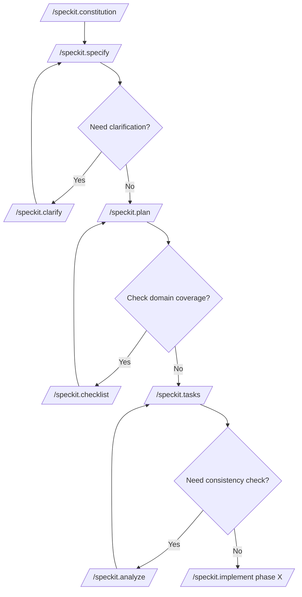

# AI-assisted Development Prompt Files

This repository is the central prompt-and-instruction library for specification-driven development (SDD) teams. Every artefact (constitution, instruction packs, ADR templates, and curated prompt suites) is designed for copy-and-paste reuse inside downstream repositories so that Copilot and other AI helpers stay aligned with the spec-kit operating model.

- [AI-assisted Development Prompt Files](#ai-assisted-development-prompt-files)
  - [Quick start](#quick-start)
  - [Repository layout](#repository-layout)
  - [Prompt catalogue](#prompt-catalogue)
    - [SDD review prompts](#sdd-review-prompts)
    - [Spec-kit governance prompts](#spec-kit-governance-prompts)
  - [Prompt review backlog](#prompt-review-backlog)
  - [Automation snippets](#automation-snippets)
  - [Roadmap](#roadmap)
  - [How to use these prompts](#how-to-use-these-prompts)
    - [Sync prompt files with `make apply`](#sync-prompt-files-with-make-apply)
    - [What changed in the spec-kit flow?](#what-changed-in-the-spec-kit-flow)
  - [Links](#links)

## Quick start

- Copy the prompts or instruction packs you need straight into downstream repositories; they are all designed to remain self-contained after paste.
- Install the required instructions by copying any repository-specific guidance into `.github/instructions` so Copilot agents inherit the rules automatically.
- Use the prompts under `.github/prompts` (or the packaged agents under `.github/agents`) to plan work, author specs, and run reviews before coding.
- Keep the workspace healthy by running `make lint` and `make test` whenever you touch source material or prompts—this mirrors the automation enforced in downstream projects that consume spec-kit deliverables.
- Capture architectural reasoning in `docs/adr` and high-level storytelling in `docs/prompts` to maintain the link between specifications and the broader system narrative.

## Repository layout

| Path                                            | Purpose                                                                                                                             |
| ----------------------------------------------- | ----------------------------------------------------------------------------------------------------------------------------------- |
| `.github/agents`                                | Ready-to-run Copilot agents (analyse, clarify, constitution, implement, plan, specify, tasks) tailored to spec-kit ceremonies.      |
| `.github/instructions`                          | Canonical instruction packs (Makefile, Python, Terraform, TypeScript, plus shared includes) dropped into downstream repos.          |
| `.github/prompts`                               | Prompt catalogue that spans SDD documentation/code/test reviews, instruction enforcers, git helpers, and spec-kit workflow prompts. |
| `.specify/memory`                               | Rolling memory snapshots for the Spec-Kit CLI to keep multi-session context.                                                        |
| `.specify/scripts`                              | Automation helpers invoked by the CLI (for example, recurring checks or content transformations).                                   |
| `.specify/templates`                            | Seed files the CLI can clone when bootstrapping new specs or documents.                                                             |
| `docs/adr/adr-template.md`                      | Opinionated ADR template wired to spec-kit sections to guarantee consistent decision records.                                       |
| `docs/prompts/my-virtual-think-tank-prompts.md` | Supporting collateral for discovery workshops and stakeholder thought-starters.                                                     |
| `.vscode/settings.json`                         | Workspace defaults so everyone shares the same formatter, lint, and Copilot configuration.                                          |
| `Makefile`                                      | Entry point for local validation (`make lint`, `make test`, and future spec-kit automation hooks).                                  |

## Prompt catalogue

### SDD review prompts

- `/sdd-01-documentation-review`
- `/sdd-02-code-compliance-review.prompt`
- `/sdd-03-test-automation-quality-review`

Use these when validating whether implementation, tests, and documentation respect every spec identifier across the entire `/specs` tree (not just the latest feature folder).

### Spec-kit governance prompts

- `speckit.*` prompts (analyse, clarify, constitution, implement, plan, specify, tasks, tasks-to-issues) orchestrate each stage of the spec-kit workflow.
- Instruction enforcement prompts (`makefile-`, `python-`, `terraform-`, `typescript-enforce-instructions`) ensure Copilot keeps repository-specific rules at hand.
- Delivery helpers such as `gh-pr-review.prompt.md` and `git-commit-and-summary.prompt.md` keep git hygiene aligned with the constitution.

## Prompt review backlog

When reviewing the constitution and every prompt, focus on the following quality gaps:

- Prompts must treat the spec-kit constitution as the ultimate source of truth.
- Reviews must evaluate the entire body of specifications (`/specs/*`) so that earlier features continue to influence documentation outside `/specs`.
- Outputs should ensure any documentation (including ADRs and README content) mirrors the latest implementation while honouring historical context.

When requesting updates, bundle the following artefacts (in order) so reviewers can supply ready-to-use Markdown files: `constitution`, `my-documentation-review`, `my-code-compliance-review`, `my-test-automation-quality-review`.

## Automation snippets

Use the `/speckit.constitution` command set below whenever you need deterministic edits applied by an agent. Insert the exact payload provided by the author—do not paraphrase.

- Update the spec-kit constitution document

  ```plaintext
  /speckit.constitution Update the constitution document by inserting the following content exactly as provided. Do not change, rewrite, reorder, summarise, or paraphrase the provided content. Preserve the author's intent and meaning exactly. Content to insert: ...
  ```

- Update my documentation review prompt

  ```plaintext
  /speckit.constitution Update the `.github/prompts/my-documentation-review.prompt.md` prompt by inserting the following content exactly as provided. Do not change, rewrite, reorder, summarise, or paraphrase the provided content. Only update the `[INCLUDE REPOSITORY-SPECIFIC ... HERE]` sections accordingly to the repository context. Preserve the author's intent and meaning exactly. Content to insert: ...
  ```

- Update my code compliance review prompt

  ```plaintext
  /speckit.constitution Update the `.github/prompts/my-code-compliance-review.prompt.md` prompt by inserting the following content exactly as provided. Do not change, rewrite, reorder, summarise, or paraphrase the provided content. Only update the `[INCLUDE REPOSITORY-SPECIFIC ... HERE]` sections accordingly to the repository context. Preserve the author's intent and meaning exactly. Content to insert: ...
  ```

- Update my test automation quality review prompt

  ```plaintext
  /speckit.constitution Update the `.github/prompts/my-test-automation-quality-review.prompt.md` prompt by inserting the following content exactly as provided. Do not change, rewrite, reorder, summarise, or paraphrase the provided content. Only update the `[INCLUDE REPOSITORY-SPECIFIC ... HERE]` sections accordingly to the repository context. Preserve the author's intent and meaning exactly. Content to insert: ...
  ```

## Roadmap

- **New prompts**
  - `architecture-review.prompt` (architect for flow)
  - `migrate-from-[tech A]-to-[tech B].prompt`
- **Instruction packs**
  - Add automation-ready GitHub Actions workflow instructions.
  - Capture Docker and Markdown conventions so every downstream repo inherits the same quality bar.
- **Spec-kit workflow prompts**
  - **Pull request creation (spec-kit-ready):** produce PR descriptions that link to each feature's `spec.md`, summarise changes by identifier, list test evidence, call out risk/rollback steps, and surface a reviewer checklist tied to the constitution.
  - **Decision record prompt (ADR creation/update):** author or update ADRs referenced from the motivating spec section, including alternatives and consequences using consistent headings and filenames.
  - **Release notes prompt (identifier-driven):** create changelog entries grouped by spec identifiers and feature folders, emphasising behaviour changes and any backwards-incompatible impacts.

## How to use these prompts



### Sync prompt files with `make apply`

- Decide which downstream repository should inherit the latest prompts/instructions and note its absolute path (for example `~/projects/my-service`).
- From this repository's root, run `make apply dest=/absolute/path/to/target`. The `dest` argument is mandatory; the helper script will create folders in the target repo if they do not yet exist.
- The task copies `.github/agents`, `.github/instructions` (and `include`), `.github/prompts`, `.github/skills`, `.github/copilot-instructions.md`, `.specify/memory/constitution.md`, `docs/adr/adr-template.md`, and `docs/.gitignore` into the destination.
- Review the downstream repo's git status, commit the synced files, and re-run its `make lint` / `make test` targets so Copilot agents there immediately benefit from the updated governance packs.

### What changed in the spec-kit flow?

The default workflow now introduces explicit governance gates so every downstream repository can see, not infer, the mandatory reviews between specification and implementation:

1. **Documentation Consistency Gate** – `/speckit.documentation.review` now runs before any coding work. It keeps ubiquitous language, identifiers, and traceability consistent across spec.md, plan.md, tasks.md, and supporting artefacts so later phases never inherit contradictory inputs.
2. **Instruction Enforcement Cycle** – After every delivery phase (Setup, Foundational, each user story, and Polish) `/[tech]-enforce-instructions` prompts plus `make lint && make test` produce a visible checklist item. This prevents silent drift from the Makefile, Python, Terraform, and TypeScript guardrails that large systems depend on.
3. **Code Compliance Review Gate** – `/speckit.code.review` now appears as a closing task, forcing engineers to reconcile implementation against the specification and constitution before calling the feature "done".
4. **Test Automation Quality Review Gate** – `/speckit.test.review` follows code compliance to ensure the test pyramid remains healthy, high-value gaps are closed, and the automation signal is strong enough to support continuous delivery.

These gates are captured in the spec template, plan template, and tasks template so every generated tasks.md shows Phase 0 governance steps, per-phase enforcement items, and the final two review commands. Benefits for large-scale spec-driven systems include:

- **Deterministic flow** – each gate blocks the next phase until its findings are resolved, which keeps multi-team streams aligned without relying on oral history.
- **Auditability** – reviewers can see checklist evidence for documentation, instruction, code, and test compliance, making governance reviews lightweight even in regulated environments.
- **Scalability** – by shifting instruction enforcement and test-quality reviews into repeatable tasks, dozens of teams can run the same process without bespoke tooling.
- **Fewer regressions** – mandatory lint/test runs at every gate catch integration issues early, preventing expensive rework when multiple features converge.
- **Better onboarding** – new contributors can read tasks.md and understand the entire spec-kit lifecycle without needing prior context.

## Links

- [Custom prompts](https://code.visualstudio.com/docs/copilot/customization/prompt-files)
- [Custom instructions](https://code.visualstudio.com/docs/copilot/customization/custom-instructions)
- [Custom agents](https://code.visualstudio.com/docs/copilot/customization/custom-agents)
- [Custom skills](https://code.visualstudio.com/docs/copilot/customization/agent-skills)
- [GitHub Awesome Copilot](https://github.com/github/awesome-copilot)
