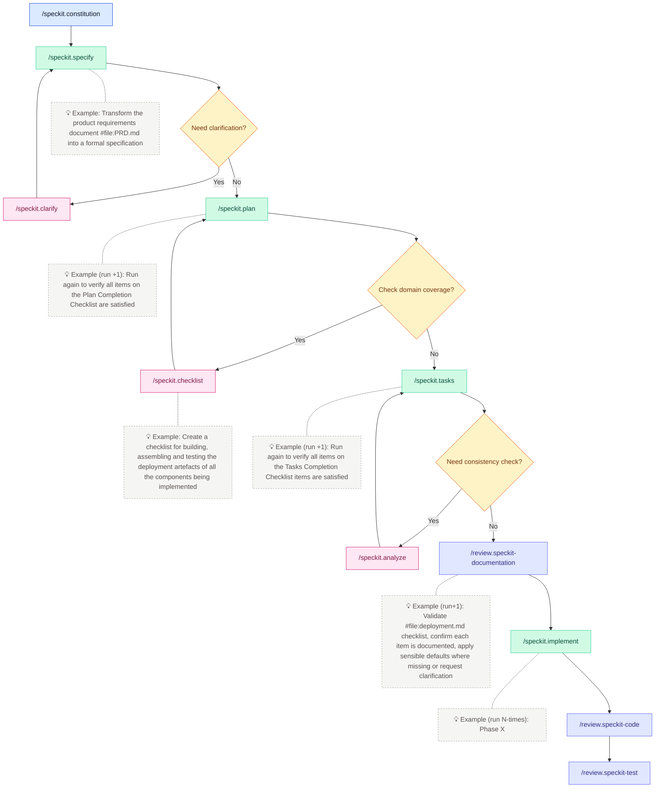

# Prompt Files

A curated, specification-first library of prompts, instruction packs, skills, and Copilot agents that keeps AI helpers aligned with the spec-kit operating model.

[](https://github.com/stefaniuk/promptfiles)
[](LICENCE.md)
[](./.github/contributing.md)

## Why this project exists

### Purpose

This library provides a central source of reusable prompts, instruction packs, skills, and Copilot agents for AI-assisted development workflows. It enables specification-driven development by keeping AI helpers aligned with a shared operating model.

### Benefit to the user

Teams gain consistent, deterministic automation across repositories. Copy-paste reuse makes onboarding faster, and governance gates ensure that specifications, code, and documentation stay synchronised.

### Problem it solves

Without shared prompt files, AI assistants drift from agreed standards, produce inconsistent outputs, and lack deterministic validation. Teams end up reinventing the same prompts and struggling to maintain alignment across projects.

### How it solves it (high level)

Prompts, agents, and skills are written directly against the spec-kit constitution. Instruction packs apply deterministic lint, test, and review rules. Every workflow leans on `make lint`, `make test`, and explicit governance gates, keeping behaviour measurable and testable.

## Quick start

### Prerequisites

- Git
- Make (GNU Make 3.82+)
- A text editor (VS Code recommended for Copilot integration)

### Setup

```bash
# Clone the repository
git clone https://github.com/stefaniuk/promptfiles.git
cd promptfiles

# Configure the development environment
make config

# Verify quality gates work
make lint && make test
```

### First run

Get up and running in minutes:

| Step  | Action                                                                                                              |
| :---: | ------------------------------------------------------------------------------------------------------------------- |
| **1** | ✂️ **Copy** the prompts or instruction packs you need straight into downstream repositories                         |
| **2** | 📦 **Install** instructions by copying guidance into `.github/instructions` so Copilot inherits rules automatically |
| **3** | 🤖 **Use** prompts under `.github/prompts` or agents under `.github/agents` to plan, spec, and review               |
| **4** | 🧪 **Validate** by running `make lint` and `make test` whenever you touch source material                           |
| **5** | 🧠 **Document** architectural reasoning in `docs/adr` for future context                                            |

**Expected output:** `make lint` and `make test` complete successfully with exit code 0.

## What it does

### Key features

- **Specification-first truth** — prompts, agents, and skills are written directly against the spec-kit constitution, so code, docs, and governance remain synchronised
- **Consistent guardrails** — instruction packs apply deterministic lint, test, and review rules across every repo, ensuring Copilot never drifts from agreed standards
- **Deterministic automation** — every workflow leans on `make lint`, `make test`, and explicit governance gates, keeping behaviour measurable and testable
- **Copy-ready building blocks** — everything is shippable by folder, making large organisations faster to onboard
- **Governance gates** — explicit checkpoints between specification and implementation

### Non-goals

- This library does not implement the underlying spec-kit framework itself
- It does not provide runtime execution environments for prompts
- It is not a replacement for language-specific linters or test frameworks

## How it solves the problem

The spec-kit lifecycle follows a structured flow:

1. **Discover** the right prompt from the library
2. **Ground** it in a specification using agents like `/speckit.specify`
3. **Plan** the implementation with `/speckit.plan`
4. **Generate tasks** with `/speckit.tasks`
5. **Implement** with `/speckit.implement`
6. **Review** with governance gates (`/review.speckit-documentation`, `/review.speckit-code`, `/review.speckit-test`)
7. **Automate** every validation step with `make lint` and `make test`



## How to use

### Configuration

No additional configuration is required beyond the initial setup. The library uses convention over configuration with sensible defaults.

### Common workflows

#### Sync prompt files to a target repository

```bash
make apply dest=/absolute/path/to/target
```

<details>
<summary><strong>What gets copied?</strong></summary>

- `.github/agents`, `.github/instructions`, `.github/prompts`, `.github/skills`
- `.github/copilot-instructions.md`
- `.specify/memory/constitution.md`
- `docs/adr/adr-template.md`, `docs/.gitignore`

</details>

> **Next step:** Review git status in the target repo, commit, and run `make lint && make test`

#### Estimate context window usage

```bash
# Default: scan Copilot prompt files
make count-tokens

# Scan all markdown, sorted by size
make count-tokens args="--all --sort-by tokens"

# Target specific paths
make count-tokens args=".github/instructions .specify"
```

The report shows:

- **Tokens** — per-file token counts
- **No IDs** — counts with identifiers like `[ID-<prefix>-NNN]` stripped
- **Usage %** — context window usage (200K baseline)

#### Run governance gates

| Gate                   | Command                         | Purpose                                       |
| :--------------------- | :------------------------------ | :-------------------------------------------- |
| 📄 **Documentation**   | `/review.speckit-documentation` | Consistency across spec.md, plan.md, tasks.md |
| ✅ **Code Compliance** | `/review.speckit-code`          | Reconcile implementation with spec            |
| 🧪 **Test Quality**    | `/review.speckit-test`          | Ensure healthy test pyramid                   |
| 🧰 **Instructions**    | `/enforce.[tech]`               | Lint & test at every delivery phase           |

<details>
<summary><strong>Why governance gates matter</strong></summary>

- **Deterministic flow** — each gate blocks the next phase until resolved
- **Auditability** — checklist evidence for compliance reviews
- **Scalability** — repeatable tasks across dozens of teams
- **Fewer regressions** — catch integration issues early
- **Better onboarding** — contributors understand the lifecycle from tasks.md

</details>

### Examples

#### Featured artefacts

| Pack                                                        | Description                                                                                                                                           |
| :---------------------------------------------------------- | :---------------------------------------------------------------------------------------------------------------------------------------------------- |
| 🤖 **[.github/agents](.github/agents)**                     | Ready-to-run Copilot agents (analyze, checklist, clarify, constitution, implement, plan, specify, tasks, taskstoissues) tuned for spec-kit ceremonies |
| 💬 **[.github/prompts](.github/prompts)**                   | Focused prompt files for documentation reviews, governance gates, tests, and refactoring support                                                      |
| 📋 **[.github/instructions](.github/instructions)**         | Coding standards and best practice packs scoped by file glob so Copilot always sees the right rules                                                   |
| 🧠 **[.github/skills](.github/skills)**                     | Bundled instructions plus helper assets that extend Copilot's capabilities for niche workflows                                                        |
| 📝 **[.specify/templates](.specify/templates)**             | Seed specs, plans, and tasks for new features                                                                                                         |
| 📄 **[docs/adr/adr-template.md](docs/adr/adr-template.md)** | Opinionated ADR template aligned with spec-kit identifiers                                                                                            |

#### Prompt naming convention

Prompts use a **prefix + category + verb** convention to keep fuzzy search fast and predictable:

| Prefix      | Purpose                                     | Example                                |
| :---------- | :------------------------------------------ | :------------------------------------- |
| `speckit.`  | Spec-kit lifecycle steps                    | `speckit.plan.prompt.md`               |
| `codebase.` | Evidence-first codebase documentation flows | `codebase.01-repository-map.prompt.md` |
| `enforce.`  | Instruction compliance enforcement          | `enforce.python.prompt.md`             |
| `review.`   | Review and audit prompts                    | `review.speckit-code.prompt.md`        |
| `util.`     | Operational utilities                       | `util.gh-pr-review.prompt.md`          |

## Resources

| Resource            | Link                                                                                         |
| :------------------ | :------------------------------------------------------------------------------------------- |
| Custom Prompts      | [VS Code Docs](https://code.visualstudio.com/docs/copilot/customization/prompt-files)        |
| Custom Instructions | [VS Code Docs](https://code.visualstudio.com/docs/copilot/customization/custom-instructions) |
| Custom Agents       | [VS Code Docs](https://code.visualstudio.com/docs/copilot/customization/custom-agents)       |
| Custom Skills       | [VS Code Docs](https://code.visualstudio.com/docs/copilot/customization/agent-skills)        |
| Awesome Copilot     | [GitHub](https://github.com/github/awesome-copilot)                                          |

## Contributing

We welcome contributions! See [.github/contributing.md](.github/contributing.md) for the full guide.

### Development setup

```bash
git clone https://github.com/stefaniuk/promptfiles.git
cd promptfiles
make config
```

### Quality commands

```bash
make lint   # Run linters (file format, markdown format, markdown links)
make test   # Run tests
```

### Quick checklist

1. **Raise an issue or PR** describing your planned changes
2. **Keep artefacts in sync** — specs, plans, tasks, and docs must align
3. **Run quality gates** — `make lint && make test` before opening a PR
4. **Follow the constitution** and NHS Engineering guidance

## Repository layout

- `.github/agents/` — Copilot agent definitions for spec-kit ceremonies
- `.github/instructions/` — Coding standards by language/framework
- `.github/prompts/` — Task-specific prompt files
- `.github/skills/` — Bundled capabilities with supporting assets
- `.specify/` — Spec-kit templates and project constitution
- `docs/adr/` — Architecture decision records
- `scripts/` — Build and utility scripts

## Roadmap

<details>
<summary><strong>📝 New Prompts</strong></summary>

- `architecture-review.prompt` — architect for flow
- `migrate-from-[tech A]-to-[tech B].prompt`

</details>
<details>
<summary><strong>🔧 Workflow Prompts</strong></summary>

- **Release notes** — changelog entries grouped by spec identifiers

</details>

## Licence

This project is licensed under the MIT Licence. See [LICENCE.md](LICENCE.md) for details.
