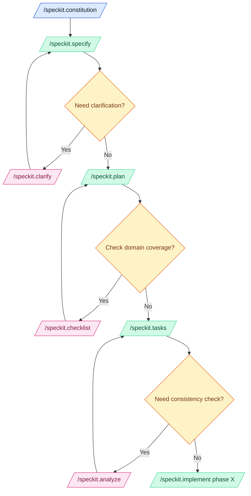

# AI-assisted Development Prompt Files

A curated, specification-first library of prompts, instruction packs, skills, and Copilot agents that keep AI helpers aligned with the spec-kit operating model. Inspired by the discoverability patterns of the [Awesome GitHub Copilot](https://github.com/github/awesome-copilot) repository, every artefact here is packaged for copy-and-paste reuse so downstream teams inherit the same deterministic workflow.

- [AI-assisted Development Prompt Files](#ai-assisted-development-prompt-files)
  - [Quick start](#quick-start)
  - [Why use this library](#why-use-this-library)
  - [Featured artefacts](#featured-artefacts)
  - [Operational workflow](#operational-workflow)
    - [How to use these prompts](#how-to-use-these-prompts)
    - [Sync prompt files with `make apply`](#sync-prompt-files-with-make-apply)
    - [Spec-kit governance gates](#spec-kit-governance-gates)
  - [Delivery backlog](#delivery-backlog)
  - [Contributing](#contributing)
  - [Links and resources](#links-and-resources)

## Quick start

- ✂️ Copy the prompts or instruction packs you need straight into downstream repositories.
- 📦 Install the required instructions by copying any repository-specific guidance into `.github/instructions` so Copilot agents inherit the rules automatically.
- 🤖 Use the prompts under `.github/prompts` (or the packaged agents under `.github/agents`) to plan work, author specs, and run reviews before coding.
- 🧪 Keep the workspace healthy by running `make lint` and `make test` whenever you touch source material or prompts - this mirrors the automation enforced in downstream projects that consume spec-kit deliverables.
- 🧠 Capture architectural reasoning in `docs/adr` and high-level storytelling in `docs/prompts` to maintain the link between specifications and the broader system narrative.

## Why use this library

- 📜 **Specification-first truth** - Prompts, agents, and skills are written directly against the spec-kit constitution, so code, docs, and governance remain synchronised.
- 🛡️ **Consistent guardrails** - Instruction packs apply deterministic lint, test, and review rules across every repo that copies them, ensuring Copilot never drifts from agreed standards.
- ⚙️ **Deterministic automation** - Every workflow leans on `make lint`, `make test`, and explicit governance gates, keeping behaviour measurable and testable.
- 📦 **Copy-ready building blocks** - Like Awesome GitHub Copilot, everything is shippable by folder, which makes large organisations faster to onboard.
- 🧠 **Human-first context** - ADR templates, prompt suites, and memory snapshots keep the narrative intact so new engineers can reason about intent before changing code.

## Featured artefacts

| Pack                                                 | What it delivers                                                                                                             | Typical usage                                                                          |
| ---------------------------------------------------- | ---------------------------------------------------------------------------------------------------------------------------- | -------------------------------------------------------------------------------------- |
| [.github/agents](.github/agents)                     | Ready-to-run Copilot agents (analyse, clarify, constitution, implement, plan, specify, tasks) tuned for spec-kit ceremonies. | Activate via Copilot agents sessions or the `/speckit.*` prompts shown in this README. |
| [.github/prompts](.github/prompts)                   | Focused prompt files for documentation reviews, governance gates, tests, and refactoring support.                            | Reference via `/speckit-*` chat commands or copy into downstream repositories.         |
| [.github/instructions](.github/instructions)         | Coding standards and best practice packs scoped by file glob so Copilot always sees the right rules.                         | Copy into downstream `.github/instructions` to inherit the same enforcement.           |
| [.github/skills](.github/skills)                     | Bundled instructions plus helper assets that extend Copilot's capabilities for niche workflows.                              | Drop into downstream repos when a richer skill set is needed.                          |
| [.specify/templates](.specify/templates)             | Seed specs, plans, and tasks for new features.                                                                               | Use with the spec-kit CLI (`specify`) or manual copy to keep specs uniform.            |
| [docs/adr/adr-template.md](docs/adr/adr-template.md) | Opinionated ADR template aligned with spec-kit identifiers.                                                                  | Reference whenever a decision record is required.                                      |

## Operational workflow

🚀 The spec-kit lifecycle mirrors the Awesome GitHub Copilot mindset: discover the right prompt or agent, ground it in a specification, and automate every validation step. Use the flow below to decide which prompt or agent to call next.

### How to use these prompts

### Sync prompt files with `make apply`

- 📍 Decide which downstream repository should inherit the latest prompts or instructions and note its absolute path (for example `~/projects/my-service`).
- 🛠️ From this repository's root, run `make apply dest=/absolute/path/to/target`. The `dest` argument is mandatory, the helper script will create folders in the target repo if they do not yet exist.
- 🧳 The task copies `.github/agents`, `.github/instructions` (and `include`), `.github/prompts`, `.github/skills`, `.github/copilot-instructions.md`, `.specify/memory/constitution.md`, `docs/adr/adr-template.md`, and `docs/.gitignore` into the destination.
- ✅ Review the downstream repo's git status, commit the synced files, and re-run its `make lint` and `make test` targets so Copilot agents there immediately benefit from the updated governance packs.

### Spec-kit governance gates

The default workflow now introduces explicit governance gates so every downstream repository can see, not infer, the mandatory reviews between specification and implementation:

1. 📄 **Documentation Consistency Gate** - `/speckit-documentation-review` runs before any coding work. It keeps ubiquitous language, identifiers, and traceability consistent across spec.md, plan.md, tasks.md, and supporting artefacts so later phases never inherit contradictory inputs.
2. 🧰 **Instruction Enforcement Cycle** - After every delivery phase (Setup, Foundational, each user story, and Polish) `/[tech]-enforce-instructions` prompts plus `make lint && make test` produce a visible checklist item. This prevents silent drift from the Makefile, Python, Terraform, and TypeScript guardrails that large systems depend on.
3. ✅ **Code Compliance Review Gate** - `/speckit-code-review` appears as a closing task, forcing engineers to reconcile implementation against the specification and constitution before calling the feature "done".
4. 🧪 **Test Automation Quality Review Gate** - `/speckit-test-review` follows code compliance to ensure the test pyramid remains healthy, high-value gaps are closed, and the automation signal is strong enough to support continuous delivery.

These gates are captured in the spec template, plan template, and tasks template so every generated tasks.md shows Phase 0 governance steps, per-phase enforcement items, and the final two review commands. Benefits for large-scale spec-driven systems include:

- **Deterministic flow** - each gate blocks the next phase until its findings are resolved, which keeps multi-team streams aligned without relying on oral history.
- **Auditability** - reviewers can see checklist evidence for documentation, instruction, code, and test compliance, making governance reviews lightweight even in regulated environments.
- **Scalability** - by shifting instruction enforcement and test-quality reviews into repeatable tasks, dozens of teams can run the same process without bespoke tooling.
- **Fewer regressions** - mandatory lint and test runs at every gate catch integration issues early, preventing expensive rework when multiple features converge.
- **Better onboarding** - new contributors can read tasks.md and understand the entire spec-kit lifecycle without needing prior context.

## Delivery backlog

- **New prompts**
  - `architecture-review.prompt` (architect for flow)
  - `migrate-from-[tech A]-to-[tech B].prompt`
- **Instruction packs**
  - Add automation-ready GitHub Actions workflow instructions.
  - Capture Docker and Markdown conventions so every downstream repo inherits the same quality bar.
- **Spec-kit workflow prompts**
  - **Pull request creation (spec-kit-ready):** produce PR descriptions that link to each feature's `spec.md`, summarise changes by identifier, list test evidence, call out risk and rollback steps, and surface a reviewer checklist tied to the constitution.
  - **Decision record prompt (ADR creation/update):** author or update ADRs referenced from the motivating spec section, including alternatives and consequences using consistent headings and filenames.
  - **Release notes prompt (identifier-driven):** create changelog entries grouped by spec identifiers and feature folders, emphasising behaviour changes and any backwards-incompatible impacts.
  - Fix
    - Characters: " " '
    - [README.md](../../README.md#context)
    - Check British English

## Contributing

- Raise an issue or PR describing which prompt, instruction pack, or agent you plan to extend so the specification remains the single source of truth.
- Keep specs, plans, tasks, and documentation in sync when behaviour changes, never rely on implicit context.
- Run `make lint` and `make test` before opening a PR to satisfy the mandatory quality gates mirrored in downstream repositories.
- Follow the project constitution alongside any relevant NHS Engineering guidance referenced there.

## Links and resources

- [Custom prompts](https://code.visualstudio.com/docs/copilot/customization/prompt-files)
- [Custom instructions](https://code.visualstudio.com/docs/copilot/customization/custom-instructions)
- [Custom agents](https://code.visualstudio.com/docs/copilot/customization/custom-agents)
- [Custom skills](https://code.visualstudio.com/docs/copilot/customization/agent-skills)
- [GitHub Awesome Copilot](https://github.com/github/awesome-copilot)
